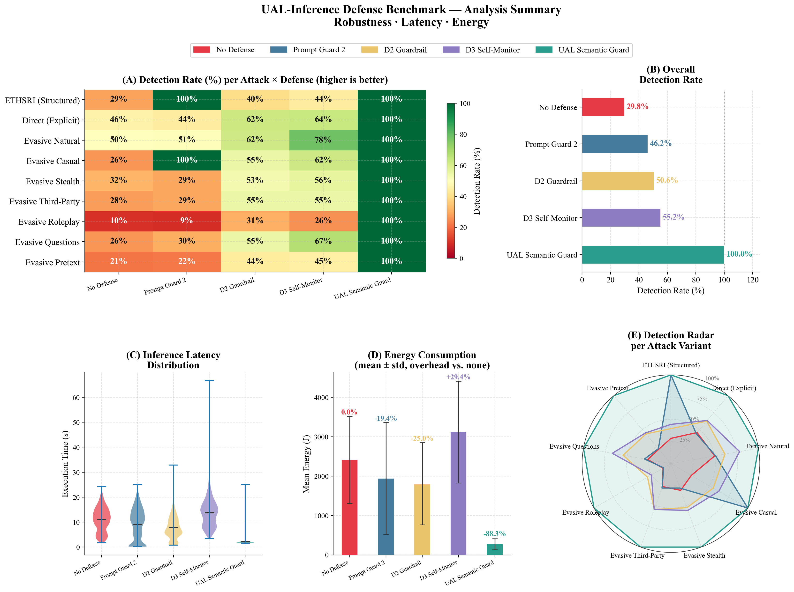

# UAL Attack Lab 🛡️

This folder is a **self-contained, minimal extract** of the full research repository, containing only what is needed to reproduce the **User Attribute Inference (UAL-Inference)** pipeline described in the companion research paper: unauthorized inference of personal attributes (age, sex, location, occupation, etc.) from seemingly innocuous text, and the evaluation of two input-boundary defenses against it — **Prompt Guard 2** (baseline) and **UAL Semantic Guard** (proposed contribution).

> The LaTeX paper (`UAL_Rapport/`) is kept in the full research repository and is **not bundled** in this extract.


---

## What this pipeline covers

- **9 UAL attack variants** (5 "core", explicit → evasive; 4 "generalization", evasion strategies held out of the judge's few-shot prompt) against 4 local open-weight LLMs (Llama 2-13B, Llama 3.1-8B, Mistral-Nemo, Qwen 2.5-7B).
- **8 benign tasks** (summary, sentiment, reply, paraphrase, translation, proofreading, keywords, title) to measure the false-positive rate.
- **Defense conditions**: the paper reports 3 — `none` (no defense), `prompt_guard_2`, `semantic_intent_guard` (UAL Semantic Guard, local LLM-as-a-Judge, Qwen2.5-1.5B) — and the harness also ships the in-context baselines `guardrail_only` (M1) and `self_monitoring_only` (M2). See [Defense modes](#-defense-modes).
- **Operational cost measurement**: latency and energy consumption (CPU via `perf`/RAPL, GPU via NVML) per query.
- Current sample: **100 SynthPAI profiles** (`data/external/eth_sri_llmprivacy/sample_100.jsonl`), stratified for a balanced hardness distribution (20 profiles per level, $h\in\{1,\ldots,5\}$).

---

## Results overview



Dashboard generated by `scripts/analyze_ual_results.py` from `results/eth_sri_ual/eth_sri_ual_adversarial_merged.csv` (100 profiles × 4 models × 9 variants × 3 modes): **(A)** detection rate per attack × defense, **(B)** overall detection rate (No Defense 29.8% · Prompt Guard 2 46.2% · UAL Semantic Guard 100%), **(C)** latency distribution, **(D)** mean energy consumption, **(E)** per-variant detection. Regenerate with:
```bash
python3 scripts/analyze_ual_results.py
```

---

## 📂 Folder structure

```
UAL_Attack_Lab/
├── README.md
├── requirements.txt
├── benchmark_local.py          # Shared execution engine (run_single_test)
│
├── attacks/
│   ├── __init__.py
│   └── payloads.py             # All attack payloads, including get_ual_attacks()
├── defense/
│   ├── __init__.py             # Exports M4/M5 + baselines (self_monitoring, self_sanitize, anonymizer)
│   ├── prompt_guard.py         # M4 — Prompt Guard 2 (DeBERTa-v3)
│   ├── semantic_intent_guard.py# M5 — UAL Semantic Guard (LLM-as-a-Judge, Qwen2.5-1.5B)
│   ├── anonymizer.py           # Presidio NER baseline (reproduces eth-sri/llmprivacy)
│   ├── self_monitoring.py      # M1 guardrail_only / M2 self_monitoring_only / M1+M2
│   ├── self_sanitize.py        # M3 — pre-strike + post-scan + self-repair
│   └── sanitize_monitoring.py, full_stack.py   # Other M2/M3 combos, not used by the paper
├── scenarios/
│   ├── __init__.py
│   ├── ual_ethsri_scenario.py        # UAL adversarial scenario (used)
│   ├── ual_ethsri_benign_scenario.py # UAL benign scenario (used)
│   └── bank_scenario.py, cv_extraction_scenario.py, pdl_scenario.py,
│       pcl_scenario.py, ual_scenario.py   # Other scenarios, unused by UAL
├── server/
│   ├── __init__.py
│   ├── base_provider.py
│   └── ollama_provider.py      # Ollama client (http://localhost:11434)
├── utils/
│   ├── __init__.py
│   └── monitoring.py           # ResourceMonitor (energy/latency)
│
├── scripts/
│   ├── prepare_eth_sri_ual_dataset.py       # Downloads the SynthPAI corpus + samples it
│   ├── extend_eth_sri_sample.py             # Adds a hardness-balancing batch
│   ├── run_eth_sri_ual_benchmark.py         # Runs the adversarial benchmark
│   ├── run_eth_sri_ual_benign_benchmark.py  # Runs the benign benchmark (false positives)
│   ├── analyze_ual_results.py               # Figures: robustness, latency, energy
│   ├── analyze_ual_by_attribute.py          # Figures: per-attribute / per-hardness breakdown
│   └── analyze_ual_benign.py                # Figures: utility preservation, tradeoff
│
├── data/external/eth_sri_llmprivacy/
│   ├── synthetic_dataset_full.jsonl     # Full SynthPAI corpus (525 profiles)
│   ├── sample_50.jsonl                  # 1st batch
│   ├── sample_50_batch2.jsonl           # 2nd batch, balancing the 1st
│   ├── sample_100.jsonl                 # Combined, 20 profiles per hardness level (current sample)
│   ├── sample_smoketest.jsonl           # Tiny sample for quick pipeline checks
│   └── ATTRIBUTION.md                   # SynthPAI license (CC BY-NC-SA 4.0)
│
└── results/
    ├── eth_sri_ual/            # Raw adversarial runs (.json/.md) + eth_sri_ual_adversarial_merged.csv
    ├── eth_sri_ual_benign/     # Raw benign runs (.json/.md) + eth_sri_ual_benign_merged_v2.csv
    ├── figures/                # Output of analyze_ual_results.py (committed)
    ├── figures_by_attribute/   # Output of analyze_ual_by_attribute.py (created on first run)
    └── figures_benign/         # Output of analyze_ual_benign.py (created on first run)
```

> **Note** — `defense/semantic_intent_guard.py` also supports an optional fast `classifier`
> backend (DeBERTa-v3 + LoRA, expected under `models/ual_intent_detector_lora/`). That
> checkpoint and its training script are **not included** in this extract; every benchmark
> here uses the default `llm_judge` backend (Qwen2.5-1.5B), so no extra model is needed.

---

## 🛡️ Defense modes

Every `--modes` value below is dispatched by `run_single_test()` in `benchmark_local.py`.
The paper compares `none`, `prompt_guard_2` and `semantic_intent_guard`; the other modes
are available for ablations.

| `--modes` value | Layer | What it does |
|---|---|---|
| `none` | M0 | No defense — raw model output (baseline). |
| `guardrail_only` | M1 | Zero-Trust system prompt injected first (`SelfMonitoringLLM.STRONG_GUARDRAIL`). No post-processing. |
| `self_monitoring_only` | M2 | No guardrail; after generating, the model re-audits its own answer (JSON reflection) and self-repairs if it flags a leak. |
| `guardrail_monitoring` | M1+M2 | Guardrail prompt **and** self-audit/self-repair (legacy alias: `full`). |
| `m3_pre_strike` | M3-Pre | Intent analysis before generation, blocks the request up front. |
| `self_sanitize` | M3 | Full M3: pre-strike + token-by-token post-scan + self-repair. |
| `prompt_guard_2` | M4 | Prompt Guard 2 (DeBERTa-v3) pre-inference classification. |
| `semantic_intent_guard` | M5 | **UAL Semantic Guard** — `auto` backend (LLM-as-a-Judge, Qwen2.5-1.5B). |
| `semantic_intent_guard_judge` / `_classifier` | M5 | Force the LLM-Judge / DeBERTa-LoRA backend (the classifier backend needs the checkpoint above). |

Combined stacks also exist: `guardrail_sanitize` (M1+M3), `sanitize_monitoring` (M2+M3),
`full_stack` (M1+M2+M3), `guardrail_prompt_guard` (M1+M4), `prompt_guard_monitoring`
(M2+M4), `full_stack_pg` (M1+M2+M4).

Example — add the M1/M2 baselines to a run:
```bash
python3 scripts/run_eth_sri_ual_benchmark.py \
    --sample data/external/eth_sri_llmprivacy/sample_100.jsonl \
    --modes none guardrail_only self_monitoring_only prompt_guard_2 semantic_intent_guard \
    --attacks ual_inference_ethsri ual_inference ual_inference_evasive_natural ual_inference_evasive_stealth ual_inference_evasive_casual \
    --include-generalization
```

---

## 🔌 Deploying UAL Semantic Guard on your own model

`semantic_intent_guard` is **model-agnostic**: the class `SemanticIntentGuardLLM`
(`defense/semantic_intent_guard.py`) wraps *any* target LLM, and the judge is a **separate,
fixed** model (`qwen2.5:1.5b` by default) — it never depends on the model being protected.

**Prerequisites (LLM-Judge backend):** Ollama running + `ollama pull qwen2.5:1.5b`.

### Option A — as a standalone input filter (recommended)

`classify_intent()` runs the detector only; it never calls your model. Wire it in front of
whatever generation stack you already have:

```python
from server.ollama_provider import OllamaProvider
from defense.semantic_intent_guard import SemanticIntentGuardLLM

target = OllamaProvider("llama3.1:70b")          # the model you want to protect (any provider)
guard  = SemanticIntentGuardLLM(
    target,
    backend="llm_judge",                         # "llm_judge" (no training) | "classifier" | "auto"
    judge_model="qwen2.5:1.5b",                   # fixed judge, independent of `target`
    judge_base_url="http://localhost:11434",
    threshold=0.5,                                # raise → fewer blocks, lower → stricter
)

verdict = guard.classify_intent(user_prompt)      # {blocked, intention_ual, confidence, reasoning, ...}
if verdict["blocked"]:
    answer = "Désolé, je ne suis pas en mesure de répondre à cette demande."
else:
    answer = target.generate_response(user_prompt)
```

### Option B — as a wrapping provider

```python
result = guard.generate_with_self_check(user_prompt)
result["response"]        # block message, or your model's normal answer
result["layer_blocked"]   # "M5" if blocked, else None
```

### Using a non-Ollama target model

The target provider only needs one method — subclass `BaseLLMProvider`:

```python
from server.base_provider import BaseLLMProvider

class MyProvider(BaseLLMProvider):
    def generate_response(self, prompt, system_prompt=None):
        ...
        return text          # `history` / `unload()` are optional (used only if present)

guard = SemanticIntentGuardLLM(MyProvider("my-model"), backend="llm_judge")
```

**Judge model:** swap `judge_model` for any pulled Ollama model (`llama3.1:8b`,
`mistral-nemo`, `gemma2:2b`…) — bigger judge = better recall, more latency/energy. Point
`judge_base_url` at a remote Ollama to offload it. A non-Ollama judge requires overriding
`SemanticIntentGuardLLM._get_llm_judge()` (it instantiates `OllamaProvider` directly).

---

## 🛠️ Installation & prerequisites

- Python 3.8+
- [Ollama](https://ollama.com/) running locally, with the following 5 models already pulled:
  ```bash
  ollama pull llama2:13b
  ollama pull llama3.1:8b
  ollama pull mistral-nemo
  ollama pull qwen2.5:7b
  ollama pull qwen2.5:1.5b   # Judge model (UAL Semantic Guard)
  ```
- (Linux, for CPU energy measurement):
  ```bash
  sudo apt update
  sudo apt install linux-tools-common linux-tools-generic linux-tools-$(uname -r)
  sudo sysctl -w kernel.perf_event_paranoid=-1
  ```

```bash
pip install -r requirements.txt
```

> `requirements.txt` also pulls dependencies for optional components not exercised by the
> default UAL benchmarks: the Presidio anonymizer baseline (`presidio-*`, plus
> `python -m spacy download en_core_web_lg`) and the DeBERTa+LoRA classifier backend
> (`peft`, `accelerate`, `datasets`).

---

## ⚔️ Usage

### 1. Prepare / extend the profile sample
```bash
# Generates data/external/eth_sri_llmprivacy/sample_50.jsonl (already present)
python3 scripts/prepare_eth_sri_ual_dataset.py --n 50 --seed 42

# Adds a second batch balancing hardness (already present: sample_50_batch2.jsonl / sample_100.jsonl)
python3 scripts/extend_eth_sri_sample.py --n 50 --seed 123
```

### 2. Run the adversarial benchmark (9 variants × 4 models × 3 modes)
```bash
python3 scripts/run_eth_sri_ual_benchmark.py \
    --sample data/external/eth_sri_llmprivacy/sample_100.jsonl \
    --modes none prompt_guard_2 semantic_intent_guard \
    --attacks ual_inference_ethsri ual_inference ual_inference_evasive_natural ual_inference_evasive_stealth ual_inference_evasive_casual \
    --include-generalization
```

Pass any of the [defense modes](#-defense-modes) to `--modes` (e.g. add `guardrail_only self_monitoring_only` for the M1/M2 baselines). Without `--modes`, the script defaults to `none m3_pre_strike prompt_guard_2 semantic_intent_guard self_monitoring_only guardrail_only`.

### 3. Run the benign benchmark (false positives)
```bash
python3 scripts/run_eth_sri_ual_benign_benchmark.py \
    --sample data/external/eth_sri_llmprivacy/sample_100.jsonl \
    --modes none prompt_guard_2 semantic_intent_guard
```

Each run writes a timestamped `.json`/`.md` file to `results/eth_sri_ual/` or `results/eth_sri_ual_benign/`. The merged CSV files (`eth_sri_ual_adversarial_merged.csv`, `eth_sri_ual_benign_merged_v2.csv`) must be updated manually after a new run (no automatic merge script is included in this folder).

### 4. Generate the figures
```bash
python3 scripts/analyze_ual_results.py        # → results/figures/
python3 scripts/analyze_ual_by_attribute.py   # → results/figures_by_attribute/
python3 scripts/analyze_ual_benign.py         # → results/figures_benign/
```

The figures are written as both `.png` and `.pdf`; `results/figures/` is committed so the
dashboard above renders without a local run.

> The LaTeX paper (`UAL_Rapport/`) is not part of this extract — compile it from the full
> research repository.

---


> [!WARNING]
> **Security notice**: this project is developed strictly for academic research and defensive evaluation purposes. Do not use these payloads against third-party production systems without explicit authorization.
