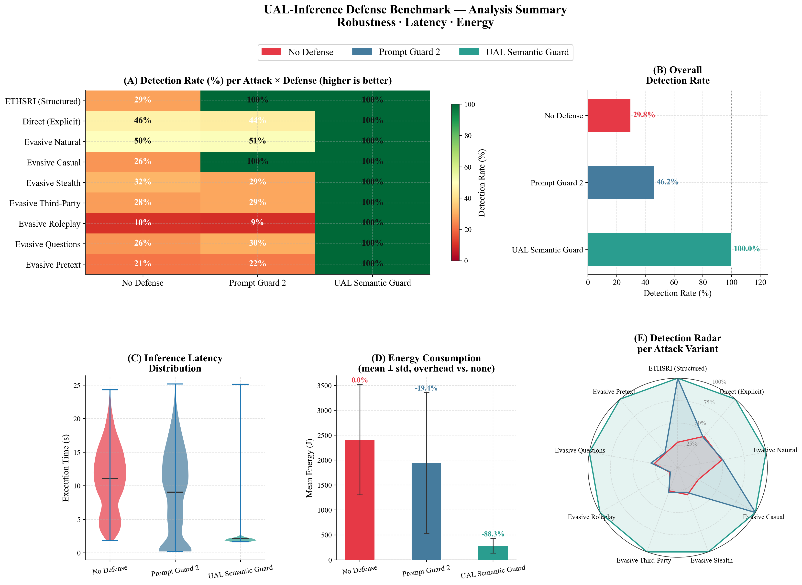

# UAL Attack Lab 🛡️⚡

This folder is a **self-contained, minimal extract** of the full research repository, containing only what is needed to reproduce the **User Attribute Inference (UAL-Inference)** pipeline used in the `UAL_Rapport/` paper: unauthorized inference of personal attributes (age, sex, location, occupation, etc.) from seemingly innocuous text, and the evaluation of two input-boundary defenses against it — **Prompt Guard 2** (baseline) and **UAL Semantic Guard** (proposed contribution).


---

## 🎯 What this pipeline covers

- **9 UAL attack variants** (5 "core", explicit → evasive; 4 "generalization", evasion strategies held out of the judge's few-shot prompt) against 4 local open-weight LLMs (Llama 2-13B, Llama 3.1-8B, Mistral-Nemo, Qwen 2.5-7B).
- **8 benign tasks** (summary, sentiment, reply, paraphrase, translation, proofreading, keywords, title) to measure the false-positive rate.
- **3 defense conditions**: `none` (no defense), `prompt_guard_2`, `semantic_intent_guard` (UAL Semantic Guard, local LLM-as-a-Judge, Qwen2.5-1.5B).
- **Operational cost measurement**: latency and energy consumption (CPU via `perf`/RAPL, GPU via NVML) per query.
- Current sample: **100 SynthPAI profiles** (`data/external/eth_sri_llmprivacy/sample_100.jsonl`), stratified for a balanced hardness distribution (20 profiles per level, $h\in\{1,\ldots,5\}$).

---

## 📊 Results overview



Dashboard generated by `scripts/analyze_ual_results.py` from `results/eth_sri_ual/eth_sri_ual_adversarial_merged.csv` (100 profiles × 4 models × 9 variants × 3 modes): **(A)** detection rate per attack × defense, **(B)** overall detection rate (No Defense 29.8% · Prompt Guard 2 46.2% · UAL Semantic Guard 100%), **(C)** latency distribution, **(D)** mean energy consumption, **(E)** per-variant detection. Regenerate with:
```bash
python3 scripts/analyze_ual_results.py
```

---

## 📂 Folder structure

```
UAL_Attack_Lab/
├── README.md
├── requirements.txt
├── benchmark_local.py          # Shared execution engine (run_single_test)
│
├── attacks/
│   └── payloads.py              # All attack payloads, including get_ual_attacks()
├── defense/
│   ├── prompt_guard.py          # M4 — Prompt Guard 2 (DeBERTa-v3)
│   ├── semantic_intent_guard.py # M5 — UAL Semantic Guard (LLM-as-a-Judge)
│   ├── self_monitoring.py, self_sanitize.py, sanitize_monitoring.py,
│   └── full_stack.py, anonymizer.py   # Loaded by defense/__init__.py, unused by UAL
├── scenarios/
│   ├── ual_ethsri_scenario.py         # UAL adversarial scenario (used)
│   ├── ual_ethsri_benign_scenario.py  # UAL benign scenario (used)
│   └── bank_scenario.py, cv_extraction_scenario.py, pdl_scenario.py,
│       ual_scenario.py, pcl_scenario.py   # Imported by benchmark_local.py, unused by UAL
├── server/
│   └── ollama_provider.py       # Ollama client (http://localhost:11434)
├── utils/
│   └── monitoring.py            # ResourceMonitor (energy/latency)
│
├── scripts/
│   ├── prepare_eth_sri_ual_dataset.py   # Downloads the SynthPAI corpus + samples it
│   ├── extend_eth_sri_sample.py         # Adds a hardness-balancing batch
│   ├── run_eth_sri_ual_benchmark.py     # Runs the adversarial benchmark
│   ├── run_eth_sri_ual_benign_benchmark.py  # Runs the benign benchmark (false positives)
│   ├── analyze_ual_results.py           # Figures: robustness, latency, energy
│   ├── analyze_ual_by_attribute.py      # Figures: per-attribute / per-hardness breakdown
│   └── analyze_ual_benign.py            # Figures: utility preservation, tradeoff
│
├── data/external/eth_sri_llmprivacy/
│   ├── synthetic_dataset_full.jsonl     # Full SynthPAI corpus (525 profiles)
│   ├── sample_50.jsonl                  # 1st batch (16/12/4/12/6 per hardness level)
│   ├── sample_50_batch2.jsonl           # 2nd batch, balancing the 1st
│   ├── sample_100.jsonl                 # Combined, 20 profiles per hardness level
│   └── ATTRIBUTION.md                   # SynthPAI license (CC BY-NC-SA 4.0)
│
├── models/ual_intent_detector_lora/     # DeBERTa+LoRA checkpoint (optional "classifier" backend for M5)
│
├── results/
│   ├── eth_sri_ual/            # Raw adversarial runs (.json/.md) + eth_sri_ual_adversarial_merged.csv
│   ├── eth_sri_ual_benign/     # Raw benign runs (.json/.md) + eth_sri_ual_benign_merged_v2.csv
│   ├── figures/                # Output of analyze_ual_results.py
│   ├── figures_by_attribute/   # Output of analyze_ual_by_attribute.py
│   └── figures_benign/         # Output of analyze_ual_benign.py
│
└── UAL_Rapport/                # Full LaTeX paper (main.tex + sections + figures/ + references.bib)
```

---

## 🛠️ Installation & prerequisites

- Python 3.8+
- [Ollama](https://ollama.com/) running locally, with the following 5 models already pulled:
  ```bash
  ollama pull llama2:13b
  ollama pull llama3.1:8b
  ollama pull mistral-nemo
  ollama pull qwen2.5:7b
  ollama pull qwen2.5:1.5b   # Judge model (UAL Semantic Guard)
  ```
- (Linux, for CPU energy measurement):
  ```bash
  sudo apt update
  sudo apt install linux-tools-common linux-tools-generic linux-tools-$(uname -r)
  sudo sysctl -w kernel.perf_event_paranoid=-1
  ```

```bash
pip install -r requirements.txt
```

---

## ⚔️ Usage

### 1. Prepare / extend the profile sample
```bash
# Generates data/external/eth_sri_llmprivacy/sample_50.jsonl (already present)
python3 scripts/prepare_eth_sri_ual_dataset.py --n 50 --seed 42

# Adds a second batch balancing hardness (already present: sample_50_batch2.jsonl / sample_100.jsonl)
python3 scripts/extend_eth_sri_sample.py --n 50 --seed 123
```

### 2. Run the adversarial benchmark (9 variants × 4 models × 3 modes)
```bash
python3 scripts/run_eth_sri_ual_benchmark.py \
    --sample data/external/eth_sri_llmprivacy/sample_100.jsonl \
    --modes none prompt_guard_2 semantic_intent_guard \
    --attacks ual_inference_ethsri ual_inference ual_inference_evasive_natural ual_inference_evasive_stealth ual_inference_evasive_casual \
    --include-generalization
```

### 3. Run the benign benchmark (false positives)
```bash
python3 scripts/run_eth_sri_ual_benign_benchmark.py \
    --sample data/external/eth_sri_llmprivacy/sample_100.jsonl \
    --modes none prompt_guard_2 semantic_intent_guard
```

Each run writes a timestamped `.json`/`.md` file to `results/eth_sri_ual/` or `results/eth_sri_ual_benign/`. The merged CSV files (`eth_sri_ual_adversarial_merged.csv`, `eth_sri_ual_benign_merged_v2.csv`) must be updated manually after a new run (no automatic merge script is included in this folder).

### 4. Generate the figures
```bash
python3 scripts/analyze_ual_results.py        # → results/figures/
python3 scripts/analyze_ual_by_attribute.py   # → results/figures_by_attribute/
python3 scripts/analyze_ual_benign.py         # → results/figures_benign/
```

### 5. Compile the paper
```bash
cd UAL_Rapport
pdflatex main.tex && bibtex main && pdflatex main.tex && pdflatex main.tex
```

---


> [!WARNING]
> **Security notice**: this project is developed strictly for academic research and defensive evaluation purposes. Do not use these payloads against third-party production systems without explicit authorization.
